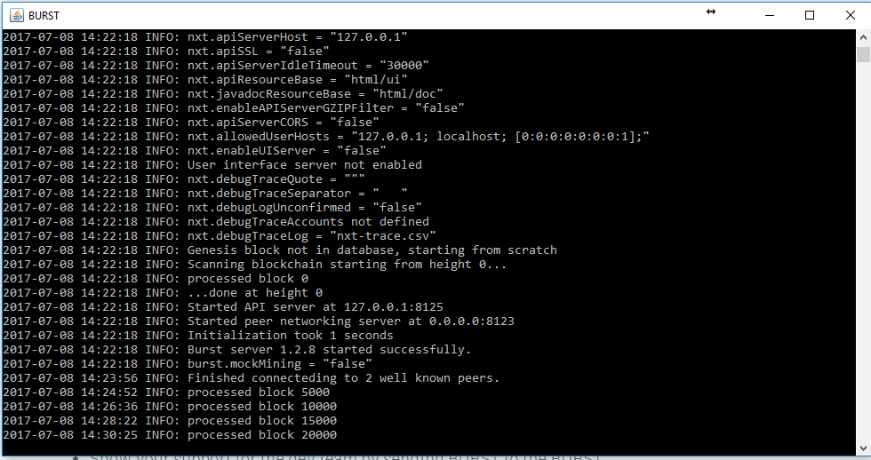

## Burstcoin Core Wallet

The Burst Core wallet is the official version of the Burst wallet. It is available for all operating systems but does not include added functionnalities like plotting, mining, or passphrase management, unlike Qbundle. This tutorial is going to walk you through getting Burst Core completely set up on any computer running on Windows.

### Prerequisties

- Synchronized Computer Clock
- Windows 7 or 8 64-bit
- Latest version of Java 64-bit
- Dual-Core or Better CPU
- 4GB RAM
- 10GB Hard Drive Space

Go to the [download section of the wallet repository](https://github.com/PoC-Consortium/burstcoin/releases),  and download the Burst Core wallet on your computer’s desktop (the file should be named `burstcoin-1.2.9.zip` or similar, depending to the version of the wallet).

Extract the content of the `.zip` file to the desired location on your computer.

### Synchronizing the Burstcoin blockchain

You have probably heard the term “blockchain” used many times on your way to finding Burst. Basically, the blockchain is all of the records and information for the Burst network. It’s the entire Burst history of everything everyone has done with Burst. The accounts, the transactions, the addresses…everything all kept in order, and all publicly viewable. All of this information is organized neatly into “blocks” and stacked on top of each other into a chain. What you need to do now, is to get the Burst blockchain.

Navigate to the folder in which you extracted the content of the `.zip` file

Doube-click on the file named run.bat

This will open up the Burst Core client and you will see a bunch of text scrolling by.

What it is doing is connecting to the network. After it gets some connections established to other Burst nodes that are running, it’ll check to see if it has an up to date blockchain. You won’t have it, so it will start downloading it. It will create a new folder named burst_db in your installation folder, and will be processing and adding the blockchain history to a couple files in there. These files are burst.mv.db and burst.trace.db . Now, this process will most likely take several hours, so you need to leave your computer running and connected to the internet. You can go about whatever else you need to do on the computer.

**PLEASE NOTE**: If you need to close down the Burst client, or reboot your computer, you should try to do so “gracefully”. First, click on the window of the Burst client program. Next hold down the Ctrl button and hit the C button twice. This is the best way to shut down Burst to keep the blockchain file from being corrupted.

You’ll see on the screen that the Burst client is processing blocks, and will do so until it catches up with the current block. This can take anywhere from several hours to days. The speed of this is determined by a lot of different factors:

- Nodes you are connected to
- Your internet connection
- Your computer specifications

Your Burstcoin core wallet has been installed and can be found on [http://localhost:8125](http://localhost:8125)

## Qbundle
